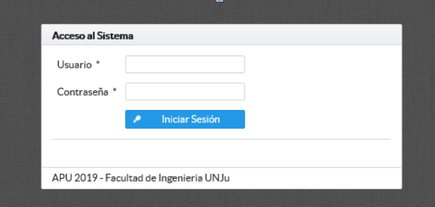
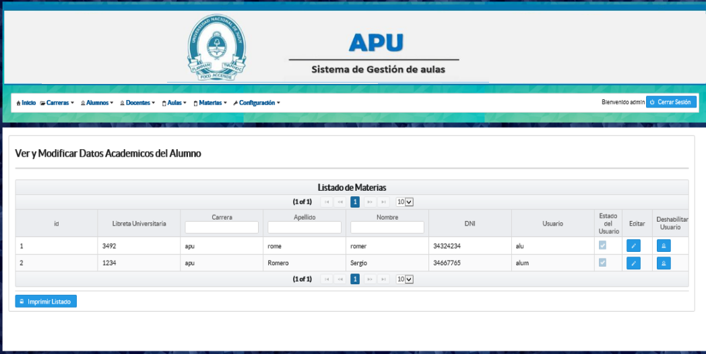
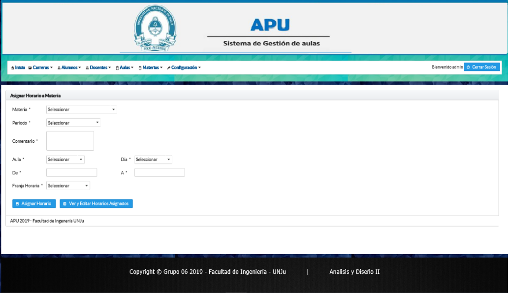
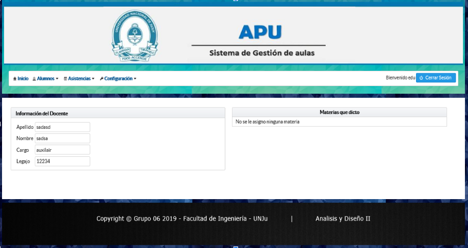
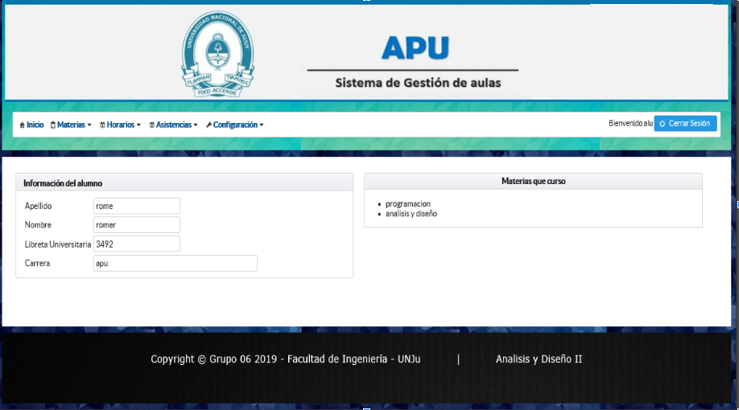

# Proyecto-Final---Aulas
Proyecto web Implementado con JSF-Primefaces y Hibernate. Para la materia Programación visual - UNJu

## Capturas de pantallas de algunas interfaces del sistema

## Login

## Listado de Alumnos

## Asignación de horario a materias

## Detalles del docente y materias que dicta

## Detalles del alumno y materias que cursa
